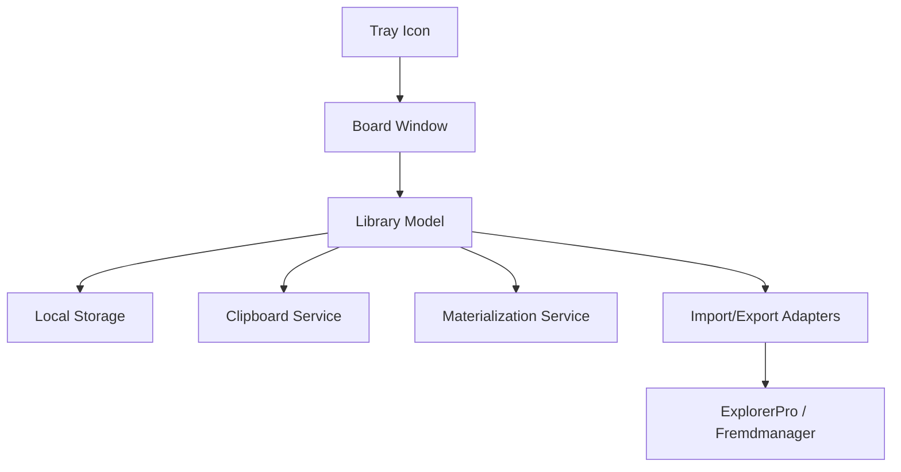

# ARCHITECTURE.md - Struktur & Architekturkonzept

> PromptBoard ist inzwischen technisch umgesetzt. Diese Datei hält die
> Zielarchitektur, den gewachsenen Zuschnitt des Desktop-Tools und die
> weiterhin gültigen Leitplanken für spätere Iterationen fest.

## Overview

PromptBoard sollte als schlanke Desktop-Anwendung mit klar getrennten Verantwortlichkeiten aufgebaut werden. Die Kernidee ist nicht ein großer Prompt-Manager, sondern ein schneller lokaler Zugriffspunkt auf wiederverwendbare LLM-Bausteine.

Für den MVP empfiehlt sich eine Windows-First-Architektur mit PySide6:

- Tray-Shell
- Board-Fenster
- Eintragsmodell
- lokale Speicherung
- Clipboard-Ausgabe
- Markdown-Materialisierung
- optionale Import-/Export-Adapter

## Empfohlene Module

| Modul | Zweck | MVP? |
|---|---|:---:|
| **Tray Shell** | Systemtray-Icon, Öffnen/Schließen, Basisaktionen | Ja |
| **Board Window** | Hauptfenster mit Liste, Filter, Editor und Vorschau | Ja |
| **Library Model** | Gemeinsames Datenmodell für Einträge und Typen | Ja |
| **Storage** | Lokale Persistenz, atomare Schreibvorgänge | Ja |
| **Clipboard Service** | Kopieren von Einträgen in die Zwischenablage | Ja |
| **Materialization Service** | Schreiben von `.md`-Dateien an konfigurierten Zielpfad | Ja |
| **Settings** | Zielpfad, Fensterzustand, Sortierung, Defaults | Ja |
| **ExplorerPro Adapter** | Import-/Austauschgrenze zu ExplorerPro | Später / früh mitdenken |
| **Prompt Manager Adapter** | Import des aktuellsten Prompts aus Fremdtool | Später / früh mitdenken |

## Konzeptioneller Datenfluss



## Kernobjekte

| Objekt | Minimale Felder für MVP |
|---|---|
| **LibraryItem** | ID, Typ, Name, Inhalt, Kategorie, Tags, updated_at |
| **Settings** | materialize_path, sort_mode, filter_mode, window_state |
| **ImportResult** | Quelle, Anzahl, Konflikte, Warnungen |
| **MaterializationRequest** | item_id, target_path, overwrite |

## Speicherstrategie

Für den MVP ist eine lokale JSON-basierte Speicherung sinnvoll. Nach Sichtung von ProfiPrompt ist zusätzlich klar: Dort existiert bereits ein lokales Speichermodell mit `prompts.json`, `boards.json` und `QSettings`.

Für PromptBoard ergeben sich daraus drei sinnvolle Ebenen:

- **Kompatibler Kern:** Prompt- und Board-nahe Felder aus ProfiPrompt soweit sinnvoll wiederverwenden
- **PromptBoard-Erweiterung:** zusätzliche Typen wie `SKILL`, `WORKFLOW`, `ROLLE`, `AGENT`
- **Adapter-Schicht:** Einlesen oder Überführen vorhandener ProfiPrompt-Daten

Das spricht für eine JSON-Strategie mit möglicher Teilkompatibilität statt für einen kompletten Neuansatz.

### Vorteile

- einfach
- leicht portierbar
- gut für kleines Datenvolumen
- schnell testbar
- Kompatibilität zu bestehendem ProfiPrompt-Speicher wird realistischer

Zusätzlich kann die Materialisierung nach Markdown ein reiner Exportpfad bleiben. Das bedeutet:

- interne Quelle bleibt JSON
- `.md`-Dateien werden gezielt erzeugt
- keine harte Pflicht zur bidirektionalen Dateisynchronisation im MVP

### Mögliche Kompatibilitätsrichtung

Ein möglicher Mittelweg für den MVP:

- `PROMPT` orientiert sich am bestehenden ProfiPrompt-Modell
- einfache Sammlungen können sich an `Board`/`BoardItem` anlehnen
- neue PromptBoard-Typen werden über ein erweitertes Library-Modell ergänzt

Damit könnte PromptBoard später:

- ProfiPrompt-Daten direkt lesen
- ausgewählte Daten übernehmen
- oder mit einem Export-/Import-Modus kompatibel bleiben

## Warum nicht sofort SQLite?

SQLite ist möglich, aber für den MVP vermutlich unnötig schwer:

- mehr Initialaufwand
- stärkere Migrationsfragen
- geringerer Nutzen bei kleiner lokaler Bibliothek
- geringerer direkter Nutzen gegenüber dem bereits vorhandenen JSON-Modell aus ProfiPrompt

Wenn später Suche, Historie, Konflikterkennung oder größere Datenmengen wichtig werden, kann SQLite neu bewertet werden.

## UI-Leitidee

Das Hauptfenster sollte klein und fokussiert bleiben:

- linke Seite: Filter und Liste
- rechte Seite: Editor oder Vorschau
- schnelle Aktionen: Kopieren, Materialisieren, Neu, Löschen

Nicht empfehlenswert im MVP:

- tiefe verschachtelte Boards
- zu viele Tabs
- Workflow-Builder
- Drag-and-drop-Komplexität als Kern

## Zielstruktur für spätere Implementierung

```text
REL-PUB_PromptBoard/
├── docs/              # Spezifikationen, Wireframes, Import-Formate
├── src/               # Anwendungscode
├── tests/             # Modell-, Storage-, Adapter- und UI-Tests
├── workflows/         # Wiederkehrende Projektabläufe
├── _tools/            # Projektnahe Hilfswerkzeuge
└── releases/          # Distributionen ab erster releasefähiger Version
```

## Architekturprinzipien

- lokal-first
- klein vor komplett
- Services statt monolithischer UI-Logik
- Adapter-Grenzen zu Fremdtools
- atomare Speicherung
- überschreibende Materialisierung als bewusstes Default-Verhalten

## Historie

- **2026-05-10** - Initiale Zielarchitektur aus `IDEE.txt` und Projekt-Onboarding abgeleitet.
