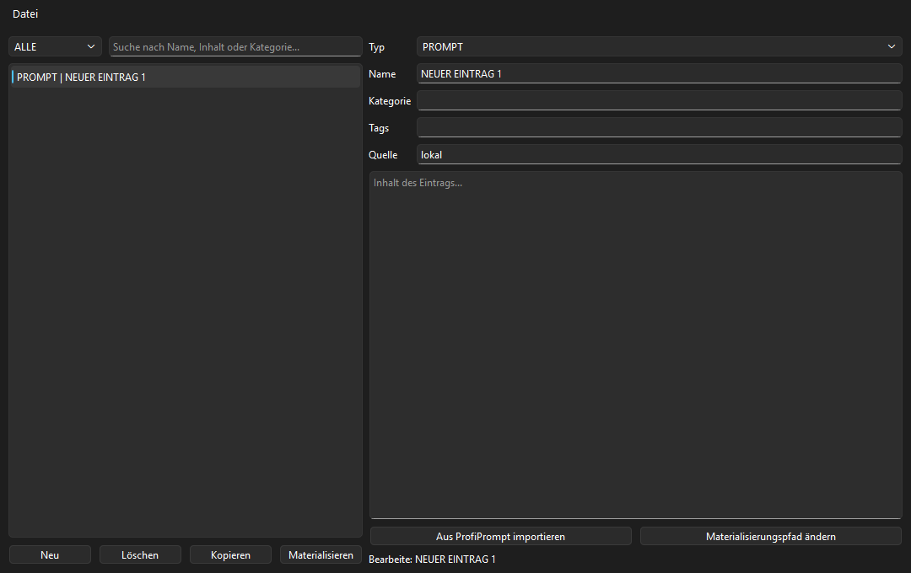
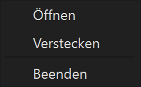
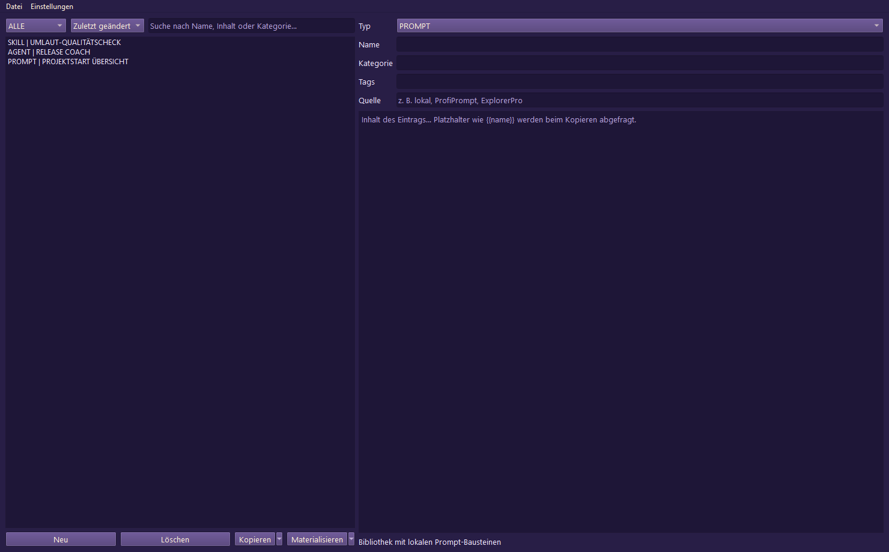
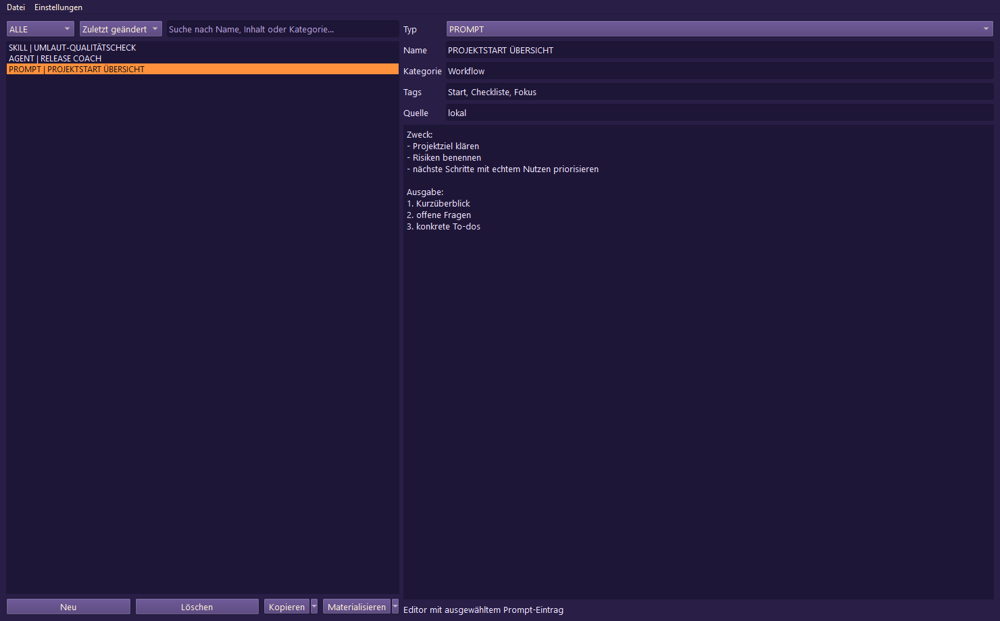
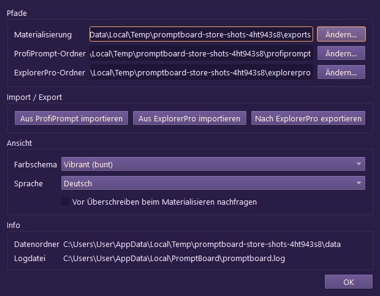

[🇩🇪 Deutsche Version](./README_de.md) | 🇬🇧 English Version

# PromptBoard

> A lightweight system tray board for prompts, skills, workflows, roles, and agents.

PromptBoard is designed as a fast desktop utility for reusable LLM building blocks. Unlike larger prompt managers, the focus here is not on versioning or complex board systems, but on rapid access: open, filter, copy, edit directly, and materialize as `.md` files when needed.

PromptBoard is a local prompt manager and Windows tray application for reusable LLM prompts, skills, workflows, roles, and agents. It keeps your prompt libraries offline, searchable, and copy-ready without requiring a cloud account or external API connections.

## Status

**Phase:** public release (`v1.1.1`), store and platform hardening active in local development  
**Code:** PySide6 desktop application with 68/68 passing pytest tests  

**CI:** [PromptBoard tests](https://github.com/file-bricks/promptboard/actions/workflows/tests.yml) running Windows Pytest and macOS/Linux source smoke checks  
**Repository:** [file-bricks/promptboard](https://github.com/file-bricks/promptboard)  
**Current Folder Status:** `LLM/REL-PUB_PromptBoard`  

## Screenshots

The local README preview and the four store views are generated directly from the live UI state.








These store screenshots can be reproducibly regenerated via `_tools/generate_store_screenshots.py`.

## Key Features & Goals

PromptBoard serves as a compact tray tool for managing local knowledge blocks:

- Prompts
- Skills
- Workflows
- Roles
- Agents

Every entry is directly editable, sortable by type and name, and copyable to the clipboard with a single click. A right-click option lets you materialize an entry as a clean Markdown file (`.md`) to a configured location (defaulting to the Desktop). The exported file is content-focused: H1 header, compact metadata block, followed by the actual prompt text.

Global hotkeys allow you to show/hide the tray window and quickly copy the last used entry.

## Comparison

- **Lighter than ProfiPrompt:** No large version history or heavy board system at the core.
- **More Robust than AutoPrompter:** No fragile keyboard or daemon hook logic.
- **More Private than Cloud Tools:** Purely offline, no account sync, external APIs, or telemetry.

## Onboarding

| For... | Read... |
|---|---|
| First Session | [START.md](./START.md) |
| Current State | [STATE.md](./STATE.md) |
| Active Tasks | [TODO.md](./TODO.md) and [AUFGABEN.txt](./AUFGABEN.txt) |
| Product Vision | [KONZEPT.md](./KONZEPT.md) |
| Feature Overview | [Feature_Analyse_PromptBoard.md](./Feature_Analyse_PromptBoard.md) |
| Architecture | [ARCHITECTURE.md](./ARCHITECTURE.md) |
| Decisions | [DECISIONS.md](./DECISIONS.md) |
| Glossary | [GLOSSARY.md](./GLOSSARY.md) |
| Agent Guidelines | [AGENTS.md](./AGENTS.md) and [CLAUDE.md](./CLAUDE.md) |

## Next Steps

The next primary focus is completing the Store-P1 path: entering real Partner Center values and documenting the elevated WACK run against `releases/PromptBoard.msix`. The macOS/Linux source smoke tests are now integrated into the project and CI pipeline.

## Running the Project

```powershell
cd 'C:\Users\User\OneDrive\.TOPICS\.SOFTWARE\LLM\REL-PUB_PromptBoard'
python -m pip install -e ".[dev]"
python src\promptboard.py
```

Under Windows, you can alternatively start the app by double-clicking `start.bat`.
