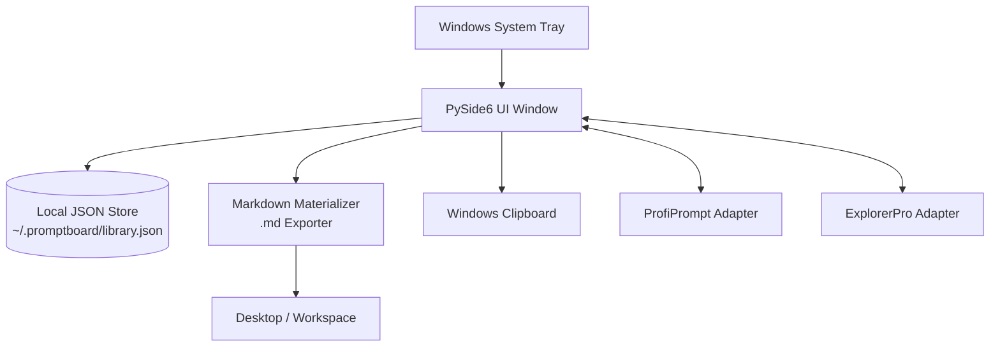

<p>
  <a href="./README_de.md">🇩🇪 Deutsch</a> &nbsp;·&nbsp; <b>🇬🇧 English</b>
</p>

<p>
  
  
  
  
  
</p>

# PromptBoard

**Your local prompt library — fast, offline, tray-ready.**

> [!NOTE]
> **Disambiguation:** `file-bricks/promptboard` is a native local-first Windows desktop tray application (Python & PySide6) designed for offline LLM prompt management and local Markdown materialization. It is not a cloud web service, SaaS platform, or browser extension.

[Features](#key-features--goals) &nbsp;·&nbsp; [Architecture](#architecture--data-flow) &nbsp;·&nbsp; [Screenshots](#screenshots) &nbsp;·&nbsp; [Install & Run](#running-the-project) &nbsp;·&nbsp; [Docs](#onboarding)

---

PromptBoard is a fast desktop utility and Windows tray application for reusable LLM building blocks: prompts, skills, workflows, roles, and agents. Unlike larger prompt managers, the focus is not on versioning or complex board systems, but on rapid access: open, filter, copy, edit directly, and materialize as `.md` files when needed. Your prompt libraries stay offline, searchable, and copy-ready without requiring a cloud account or external API connections.

## Status

**Phase:** public release (`v1.1.1`), store and platform hardening active in local development<br/>
**Code:** PySide6 desktop application with 85/85 passing pytest tests<br/>

**CI:** [PromptBoard tests](https://github.com/file-bricks/promptboard/actions/workflows/tests.yml) running Windows Pytest and macOS/Linux source smoke checks  
**Repository:** [file-bricks/promptboard](https://github.com/file-bricks/promptboard)  

## Architecture & Data Flow



## Screenshots

The local README preview and the four store views are generated directly from the live UI state.


These store screenshots can be reproducibly regenerated via `_tools/generate_store_screenshots.py`.

## Key Features & Goals

PromptBoard serves as a compact tray tool for managing local knowledge blocks:

- Prompts
- Skills
- Workflows
- Roles
- Agents

Every entry is directly editable, sortable by type and name, and copyable to the clipboard with a single click. A right-click option lets you materialize an entry as a clean Markdown file (`.md`) to a configured location (defaulting to the Desktop). The exported file is content-focused: H1 header, compact metadata block, followed by the actual prompt text.

Global hotkeys allow you to show/hide the tray window and quickly copy the last used entry.

## Comparison

- **Lighter than ProfiPrompt:** No large version history or heavy board system at the core.
- **More Robust than AutoPrompter:** No fragile keyboard or daemon hook logic.
- **More Private than Cloud Tools:** Purely offline, no account sync, external APIs, or telemetry.

## Onboarding

| For... | Read... |
|---|---|
| First Session | [START.md](./START.md) |
| Current State | [STATE.md](./STATE.md) |
| Product Vision | [KONZEPT.md](./KONZEPT.md) |
| Feature Overview | [Feature_Analyse_PromptBoard.md](./Feature_Analyse_PromptBoard.md) |
| Architecture | [ARCHITECTURE.md](./ARCHITECTURE.md) |
| Glossary | [GLOSSARY.md](./GLOSSARY.md) |
| Agent Guidelines | [AGENTS.md](./AGENTS.md) and [CLAUDE.md](./CLAUDE.md) |

## Next Steps

The next primary focus is completing the Store-P1 path: entering real Partner Center values and documenting the elevated WACK run against `releases/PromptBoard.msix`. The macOS/Linux source smoke tests are now integrated into the project and CI pipeline.

## Running the Project

```powershell
python -m pip install -e ".[dev]"
python src\promptboard.py
```

Under Windows, you can alternatively start the app by double-clicking `start.bat`.

## License

PromptBoard is licensed under [MIT](LICENSE). Runtime dependency licenses are
listed in [THIRD_PARTY_LICENSES.txt](THIRD_PARTY_LICENSES.txt).
