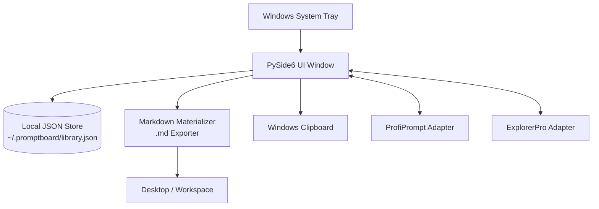

<p>
  <a href="./README_de.md">🇩🇪 Deutsch</a> &nbsp;·&nbsp; <a href="./README.md">🇬🇧 English</a> &nbsp;·&nbsp; <b>🇪🇸 Español</b> &nbsp;·&nbsp; <a href="./README_zh.md">🇨🇳 简体中文</a> &nbsp;·&nbsp; <a href="./README_ja.md">🇯🇵 日本語</a> &nbsp;·&nbsp; <a href="./README_ru.md">🇷🇺 Русский</a>
</p>

> Traducción asistida por máquina; la versión en inglés ([README.md](README.md)) es la autorizada.

<p>
  
  
  
  
  
  
  
  
</p>

# PromptBoard

**Tu biblioteca local de prompts: rápida, sin conexión y lista en la bandeja del sistema.**

> [!NOTE]
> **Aclaración:** `file-bricks/promptboard` es una aplicación de escritorio nativa para Windows (Python y PySide6), local-first y residente en la bandeja del sistema, diseñada para la gestión sin conexión de prompts de LLM y su materialización local en Markdown. No es un servicio web en la nube, una plataforma SaaS ni una extensión de navegador.

> [!TIP]
> **Integración con LLM / agentes:** Consulta [`llms.txt`](./llms.txt) para obtener contexto del proyecto legible por máquina, límites de la API, patrones de ejecución de la CLI e invariantes de arquitectura.

[Features](#key-features--goals) &nbsp;·&nbsp; [Architecture](#architecture--data-flow) &nbsp;·&nbsp; [Screenshots](#screenshots) &nbsp;·&nbsp; [Install & Run](#running-the-project) &nbsp;·&nbsp; [Docs](#onboarding)

---

PromptBoard es una utilidad de escritorio rápida y una aplicación de bandeja del sistema de Windows para bloques de construcción reutilizables de LLM: prompts, skills, workflows, roles y agentes. A diferencia de gestores de prompts más grandes, el foco no está en el control de versiones ni en sistemas de tableros complejos, sino en el acceso rápido: abrir, filtrar, copiar, editar directamente y materializar como archivos `.md` cuando haga falta. Tus bibliotecas de prompts permanecen sin conexión, con capacidad de búsqueda y listas para copiar, sin necesidad de una cuenta en la nube ni de conexiones a API externas.

## Estado

**Fase:** versión pública (`v1.1.1`), con el refuerzo para tienda y plataformas activo en el desarrollo local<br/>
**Código:** aplicación de escritorio PySide6 con 126/126 pruebas de pytest superadas<br/>

**CI:** [PromptBoard tests](https://github.com/file-bricks/promptboard/actions/workflows/tests.yml) ejecutando Pytest en Windows y comprobaciones rápidas del código fuente en macOS/Linux  
**Repositorio:** [file-bricks/promptboard](https://github.com/file-bricks/promptboard)  

### Lectura de verificación — 2026-09-18

- `python -X utf8 -m pytest -q`: **125 passed, 1 skipped (126 total)** (alcance: la suite de pruebas de Python; la prueba de capturas de pantalla se omite limpiamente en modo offscreen sin interfaz).
- `python -X utf8 tests/source_platform_smoke.py`: **OK** (prueba rápida del código fuente/offscreen; no afirma paridad nativa de la bandeja ni de los atajos de teclado en macOS/Linux).
- `python -X utf8 -m compileall -q src _tools tests scripts`: **OK**.
- `ruff check src _tools tests scripts`: **OK** (todas las comprobaciones superadas).
- La versión `v1.1.1` de GitHub está publicada; Store-P1 sigue abierto porque aún no
  están disponibles los valores reales de Partner Center, una compilación local de MSIX con
  `makeappx.exe` ni una lectura de WACK con privilegios elevados.
- La línea de artefactos publicada es `v1.1.1`. `pyproject.toml` aún contiene los
  metadatos de desarrollo no publicados `1.1.3`; esto se registra de forma explícita en lugar de
  presentarlo en silencio como un artefacto publicado de v1.1.1.

## Arquitectura y flujo de datos



## Capturas de pantalla

La vista previa local del README y las cuatro vistas de la tienda se generan directamente a partir del estado de la interfaz en vivo.


Estas capturas de pantalla de la tienda pueden regenerarse de forma reproducible mediante `_tools/generate_store_screenshots.py`.

## Características principales y objetivos

PromptBoard sirve como una herramienta compacta de bandeja para gestionar bloques de conocimiento locales:

- Prompts
- Skills
- Workflows
- Roles
- Agentes

Cada entrada se puede editar directamente, ordenar por tipo y nombre, y copiar al portapapeles con un solo clic. Una opción del menú contextual (clic derecho) permite materializar una entrada como un archivo Markdown (`.md`) limpio en una ubicación configurada (por defecto, el Escritorio). El archivo exportado se centra en el contenido: encabezado H1, bloque compacto de metadatos y, a continuación, el texto real del prompt.

Los atajos de teclado globales permiten mostrar/ocultar la ventana de la bandeja y copiar rápidamente la última entrada utilizada.

## Comparación

- **Más ligero que ProfiPrompt:** sin un gran historial de versiones ni un sistema de tableros pesado en el núcleo.
- **Más robusto que AutoPrompter:** sin lógica frágil de ganchos de teclado ni de daemons.
- **Más privado que las herramientas en la nube:** puramente sin conexión, sin sincronización de cuentas, API externas ni telemetría.

## Incorporación

| Para... | Lee... |
|---|---|
| Primera sesión | [START.md](./START.md) |
| Estado actual | [STATE.md](./STATE.md) |
| Visión del producto | [KONZEPT.md](./KONZEPT.md) |
| Resumen de funciones | [Feature_Analyse_PromptBoard.md](./Feature_Analyse_PromptBoard.md) |
| Arquitectura | [ARCHITECTURE.md](./ARCHITECTURE.md) |
| Glosario | [GLOSSARY.md](./GLOSSARY.md) |
| Directrices para agentes | [AGENTS.md](./AGENTS.md) y [CLAUDE.md](./CLAUDE.md) |

## Próximos pasos

El siguiente foco principal es completar la ruta Store-P1: introducir los valores reales de Partner Center y documentar la ejecución de WACK con privilegios elevados sobre `releases/PromptBoard.msix`. Las pruebas rápidas del código fuente para macOS/Linux ya están integradas en el proyecto y en la canalización de CI.

## Ejecución del proyecto

```powershell
python -m pip install -e ".[dev]"
python src\promptboard.py
```

En Windows, también puedes iniciar la aplicación haciendo doble clic en `start.bat`.

## Licencia

PromptBoard se distribuye bajo licencia [MIT](LICENSE). Las licencias de las dependencias de ejecución
se enumeran en [THIRD_PARTY_LICENSES.txt](THIRD_PARTY_LICENSES.txt).
