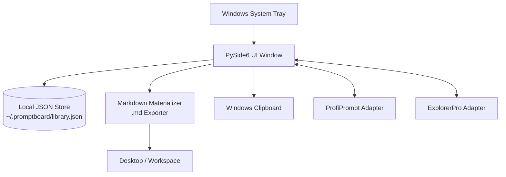

<p>
  <a href="./README_de.md">🇩🇪 Deutsch</a> &nbsp;·&nbsp; <a href="./README.md">🇬🇧 English</a> &nbsp;·&nbsp; <a href="./README_es.md">🇪🇸 Español</a> &nbsp;·&nbsp; <a href="./README_zh.md">🇨🇳 简体中文</a> &nbsp;·&nbsp; <b>🇯🇵 日本語</b> &nbsp;·&nbsp; <a href="./README_ru.md">🇷🇺 Русский</a>
</p>

> 本書は機械支援翻訳です。英語版([README.md](README.md))が正本です。

<p>
  
  
  
  
  
  
  
  
</p>

# PromptBoard

**あなたのローカルプロンプトライブラリ — 高速、オフライン、トレイ常駐対応。**

> [!NOTE]
> **補足(名称の区別):** `file-bricks/promptboard` は、オフラインでの LLM プロンプト管理とローカルでの Markdown 実体化のために設計された、ネイティブかつローカルファーストな Windows デスクトップのトレイアプリケーション(Python & PySide6)です。クラウド Web サービス、SaaS プラットフォーム、ブラウザ拡張機能ではありません。

> [!TIP]
> **LLM / エージェント連携:** 機械可読なプロジェクトコンテキスト、API の境界、CLI 実行パターン、アーキテクチャ上の不変条件については [`llms.txt`](./llms.txt) を参照してください。

[機能](#key-features--goals) &nbsp;·&nbsp; [アーキテクチャ](#architecture--data-flow) &nbsp;·&nbsp; [スクリーンショット](#screenshots) &nbsp;·&nbsp; [インストールと実行](#running-the-project) &nbsp;·&nbsp; [ドキュメント](#onboarding)

---

PromptBoard は、再利用可能な LLM の構成要素(プロンプト、スキル、ワークフロー、ロール、エージェント)のための、高速なデスクトップユーティリティ兼 Windows トレイアプリケーションです。より大規模なプロンプト管理ツールとは異なり、重点はバージョン管理や複雑なボードシステムではなく、素早いアクセスにあります。開く、絞り込む、コピーする、直接編集する、必要に応じて `.md` ファイルとして実体化する、という操作を素早く行えます。プロンプトライブラリはオフラインのまま検索可能で、コピーしてすぐ使える状態に保たれ、クラウドアカウントや外部 API 接続は不要です。

## Status

**フェーズ:** 公開リリース(`v1.1.1`)、ストアおよびプラットフォーム向けの堅牢化はローカル開発で進行中<br/>
**コード:** pytest テスト 126/126 件合格の PySide6 デスクトップアプリケーション<br/>

**CI:** [PromptBoard tests](https://github.com/file-bricks/promptboard/actions/workflows/tests.yml) — Windows での Pytest と macOS/Linux でのソースのスモークチェックを実行  
**リポジトリ:** [file-bricks/promptboard](https://github.com/file-bricks/promptboard)  

### 検証結果の読み戻し — 2026-09-18

- `python -X utf8 -m pytest -q`: **125 passed, 1 skipped (126 total)**(対象: Python テストスイート。スクリーンショットのテストはヘッドレスのオフスクリーン環境では正常にスキップされます)。
- `python -X utf8 tests/source_platform_smoke.py`: **OK**(ソース/オフスクリーンのスモークテストであり、ネイティブな macOS/Linux のトレイやホットキーの同等性を主張するものではありません)。
- `python -X utf8 -m compileall -q src _tools tests scripts`: **OK**。
- `ruff check src _tools tests scripts`: **OK**(すべてのチェックに合格)。
- GitHub リリース `v1.1.1` は公開済みです。Store-P1 は未完了のままです。実際の
  Partner-Center の値、`makeappx.exe` によるローカル MSIX ビルド、および
  管理者権限での WACK の読み戻しがまだ揃っていないためです。
- 公開済みのアーティファクトは `v1.1.1` の系列です。`pyproject.toml` には
  未リリースの開発用メタデータ `1.1.3` が残っています。これを公開済みの
  v1.1.1 アーティファクトであるかのように黙って見せかけるのではなく、
  ここに明示的に記録しています。

## Architecture & Data Flow



## Screenshots

ローカルの README 用プレビューと 4 つのストア用ビューは、実際の UI の状態から直接生成されています。


これらのストア用スクリーンショットは、`_tools/generate_store_screenshots.py` により再現可能な形で再生成できます。

## Key Features & Goals

PromptBoard は、ローカルの知識ブロックを管理するためのコンパクトなトレイツールとして機能します。

- Prompts
- Skills
- Workflows
- Roles
- Agents

すべてのエントリは直接編集でき、種類と名前で並べ替えられ、ワンクリックでクリップボードにコピーできます。右クリックのオプションにより、エントリを整った Markdown ファイル(`.md`)として、設定した場所(デフォルトはデスクトップ)に実体化できます。出力されるファイルは内容重視の構成で、H1 見出し、コンパクトなメタデータブロック、そして実際のプロンプト本文の順になっています。

グローバルホットキーにより、トレイウィンドウの表示/非表示の切り替えや、最後に使用したエントリの素早いコピーが可能です。

## Comparison

- **ProfiPrompt より軽量:** 中核に大規模なバージョン履歴や重いボードシステムを持ちません。
- **AutoPrompter より堅牢:** 壊れやすいキーボードフックやデーモンフックのロジックがありません。
- **クラウドツールよりプライバシーに配慮:** 完全にオフラインで、アカウント同期、外部 API、テレメトリはありません。

## Onboarding

| 目的 | 参照先 |
|---|---|
| 最初のセッション | [START.md](./START.md) |
| 現在の状態 | [STATE.md](./STATE.md) |
| 製品ビジョン | [KONZEPT.md](./KONZEPT.md) |
| 機能概要 | [Feature_Analyse_PromptBoard.md](./Feature_Analyse_PromptBoard.md) |
| アーキテクチャ | [ARCHITECTURE.md](./ARCHITECTURE.md) |
| 用語集 | [GLOSSARY.md](./GLOSSARY.md) |
| エージェント向けガイドライン | [AGENTS.md](./AGENTS.md) および [CLAUDE.md](./CLAUDE.md) |

## Next Steps

次の主要な焦点は Store-P1 の経路の完了です。実際の Partner Center の値を入力し、`releases/PromptBoard.msix` に対する管理者権限での WACK 実行を文書化します。macOS/Linux のソースのスモークテストは、すでにプロジェクトおよび CI パイプラインに統合されています。

## Running the Project

```powershell
python -m pip install -e ".[dev]"
python src\promptboard.py
```

Windows では、`start.bat` をダブルクリックしてアプリを起動することもできます。

## License

PromptBoard は [MIT](LICENSE) ライセンスで提供されています。実行時依存関係のライセンスは
[THIRD_PARTY_LICENSES.txt](THIRD_PARTY_LICENSES.txt) に記載されています。
