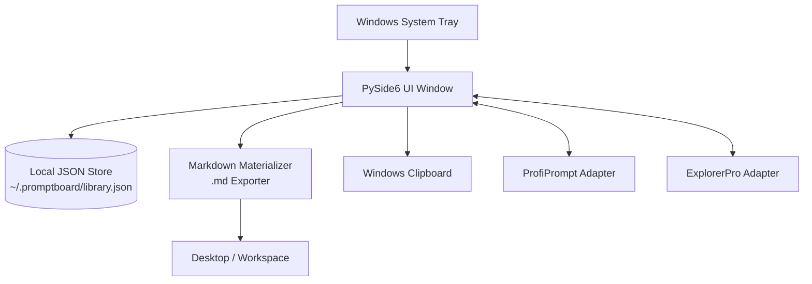

<p>
  <a href="./README_de.md">🇩🇪 Deutsch</a> &nbsp;·&nbsp; <a href="./README.md">🇬🇧 English</a> &nbsp;·&nbsp; <a href="./README_es.md">🇪🇸 Español</a> &nbsp;·&nbsp; <a href="./README_zh.md">🇨🇳 简体中文</a> &nbsp;·&nbsp; <a href="./README_ja.md">🇯🇵 日本語</a> &nbsp;·&nbsp; <b>🇷🇺 Русский</b>
</p>

> Машинно-ассистированный перевод; авторитетной является английская версия ([README.md](README.md)).

<p>
  
  
  
  
  
  
  
  
</p>

# PromptBoard

**Ваша локальная библиотека промптов — быстрая, офлайн, с поддержкой системного трея.**

> [!NOTE]
> **Уточнение:** `file-bricks/promptboard` — это нативное локальное (local-first) настольное приложение для Windows в системном трее (Python и PySide6), предназначенное для офлайн-управления промптами для LLM и локальной материализации в Markdown. Это не облачный веб-сервис, не SaaS-платформа и не расширение для браузера.

> [!TIP]
> **Интеграция с LLM / агентами:** см. [`llms.txt`](./llms.txt) — машиночитаемый контекст проекта, границы API, шаблоны запуска CLI и архитектурные инварианты.

[Возможности](#key-features--goals) &nbsp;·&nbsp; [Архитектура](#architecture--data-flow) &nbsp;·&nbsp; [Скриншоты](#screenshots) &nbsp;·&nbsp; [Установка и запуск](#running-the-project) &nbsp;·&nbsp; [Документация](#onboarding)

---

PromptBoard — это быстрая настольная утилита и приложение для системного трея Windows для многократно используемых строительных блоков LLM: промптов, навыков (skills), рабочих процессов (workflows), ролей и агентов. В отличие от более крупных менеджеров промптов, акцент здесь не на версионировании и сложных системах досок, а на быстром доступе: открыть, отфильтровать, скопировать, отредактировать напрямую и при необходимости материализовать в виде файлов `.md`. Ваши библиотеки промптов остаются офлайн, доступными для поиска и готовыми к копированию — без облачной учётной записи и подключений к внешним API.

## Статус

**Этап:** публичный релиз (`v1.1.1`), в локальной разработке ведётся усиление под магазины и платформы<br/>
**Код:** настольное приложение на PySide6, 126/126 успешно проходящих тестов pytest<br/>

**CI:** [PromptBoard tests](https://github.com/file-bricks/promptboard/actions/workflows/tests.yml) — запуск Windows Pytest и smoke-проверок исходников для macOS/Linux  
**Репозиторий:** [file-bricks/promptboard](https://github.com/file-bricks/promptboard)  

### Результаты проверки — 2026-09-18

- `python -X utf8 -m pytest -q`: **125 passed, 1 skipped (126 total)** (охват: набор тестов Python; тест скриншотов корректно пропускается в headless-режиме offscreen).
- `python -X utf8 tests/source_platform_smoke.py`: **OK** (smoke-проверка исходников/offscreen; она не утверждает паритет нативного трея или горячих клавиш на macOS/Linux).
- `python -X utf8 -m compileall -q src _tools tests scripts`: **OK**.
- `ruff check src _tools tests scripts`: **OK** (все проверки пройдены).
- Релиз GitHub `v1.1.1` опубликован; Store-P1 остаётся открытым, поскольку реальные
  значения Partner-Center, локальная сборка MSIX с помощью `makeappx.exe` и
  проверка WACK с повышенными правами пока недоступны.
- Опубликованная линия артефактов — `v1.1.1`. В `pyproject.toml` по-прежнему указаны
  неопубликованные метаданные разработки `1.1.3`; это зафиксировано явно, а не
  выдаётся молча за опубликованный артефакт v1.1.1.

## Architecture & Data Flow



## Screenshots

Локальный предпросмотр для README и четыре представления для магазина генерируются непосредственно из состояния живого интерфейса.


Эти скриншоты для магазина можно воспроизводимо перегенерировать с помощью `_tools/generate_store_screenshots.py`.

## Key Features & Goals

PromptBoard служит компактным инструментом в трее для управления локальными блоками знаний:

- Промпты
- Навыки (Skills)
- Рабочие процессы (Workflows)
- Роли
- Агенты

Каждую запись можно напрямую редактировать, сортировать по типу и имени и копировать в буфер обмена одним щелчком. Пункт контекстного меню (правая кнопка мыши) позволяет материализовать запись в виде чистого файла Markdown (`.md`) в настроенном месте (по умолчанию — на рабочем столе). Экспортированный файл ориентирован на содержимое: заголовок H1, компактный блок метаданных, а затем сам текст промпта.

Глобальные горячие клавиши позволяют показывать/скрывать окно в трее и быстро копировать последнюю использованную запись.

## Сравнение

- **Легче, чем ProfiPrompt:** в основе нет громоздкой истории версий и тяжёлой системы досок.
- **Надёжнее, чем AutoPrompter:** никакой хрупкой логики перехвата клавиатуры или демонов.
- **Приватнее, чем облачные инструменты:** исключительно офлайн, без синхронизации учётной записи, внешних API и телеметрии.

## Onboarding

| Для... | Читайте... |
|---|---|
| Первая сессия | [START.md](./START.md) |
| Текущее состояние | [STATE.md](./STATE.md) |
| Видение продукта | [KONZEPT.md](./KONZEPT.md) |
| Обзор возможностей | [Feature_Analyse_PromptBoard.md](./Feature_Analyse_PromptBoard.md) |
| Архитектура | [ARCHITECTURE.md](./ARCHITECTURE.md) |
| Глоссарий | [GLOSSARY.md](./GLOSSARY.md) |
| Руководства для агентов | [AGENTS.md](./AGENTS.md) и [CLAUDE.md](./CLAUDE.md) |

## Следующие шаги

Ближайший основной приоритет — завершить путь Store-P1: ввести реальные значения Partner Center и задокументировать запуск WACK с повышенными правами для `releases/PromptBoard.msix`. Smoke-тесты исходников для macOS/Linux теперь интегрированы в проект и конвейер CI.

## Running the Project

```powershell
python -m pip install -e ".[dev]"
python src\promptboard.py
```

В Windows приложение можно также запустить двойным щелчком по `start.bat`.

## Лицензия

PromptBoard распространяется по лицензии [MIT](LICENSE). Лицензии зависимостей времени выполнения
перечислены в [THIRD_PARTY_LICENSES.txt](THIRD_PARTY_LICENSES.txt).
