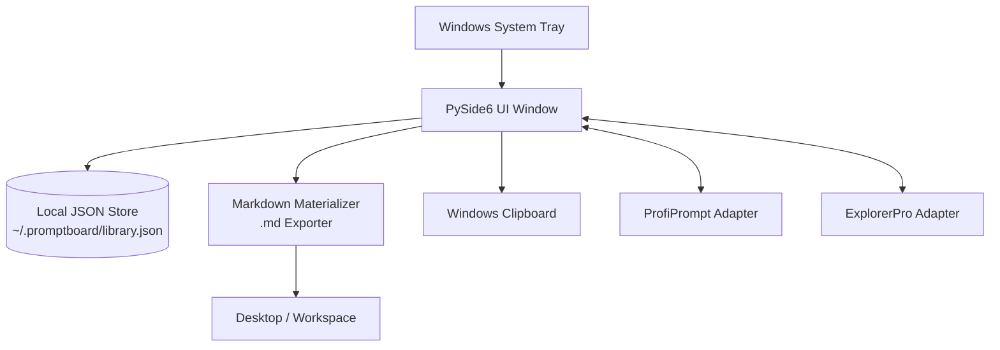
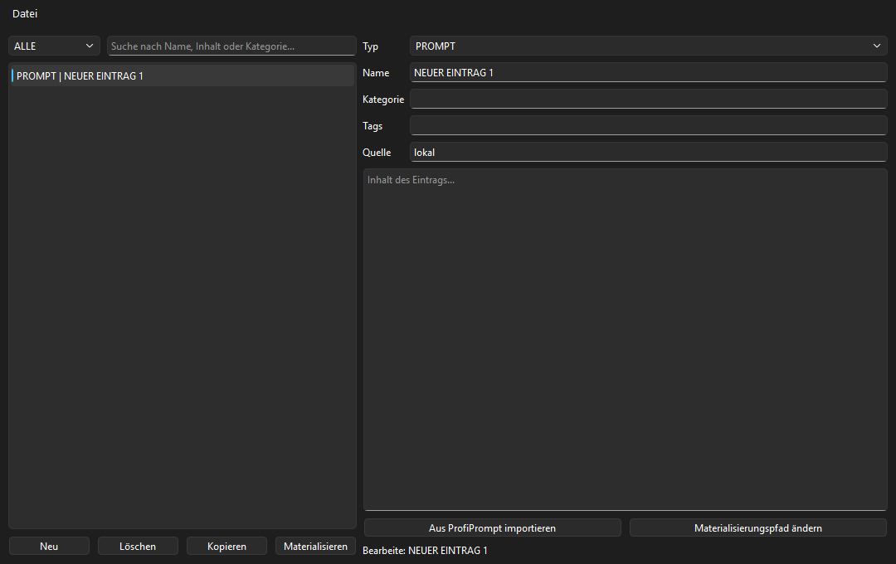
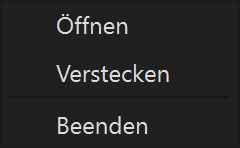
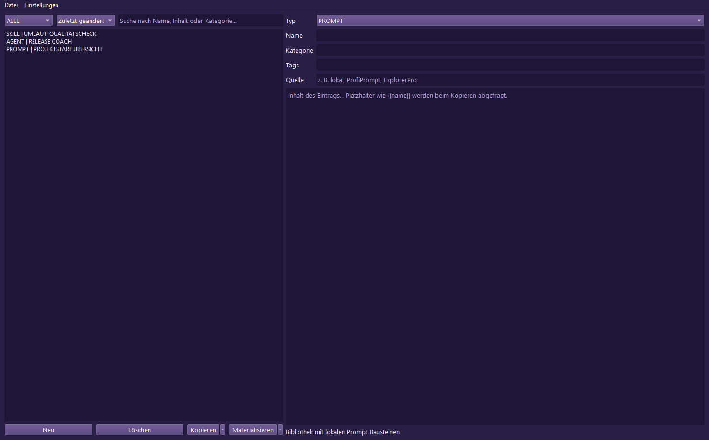
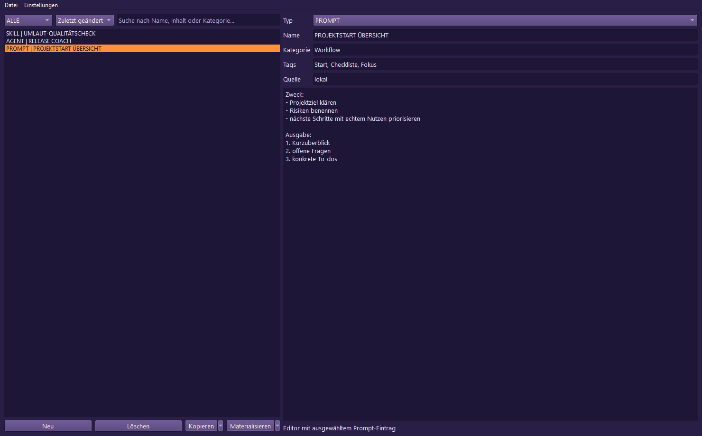
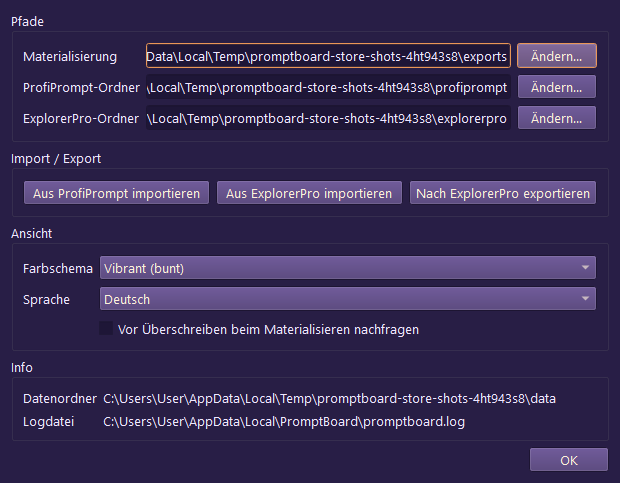

<p>
  <a href="./README_de.md">🇩🇪 Deutsch</a> &nbsp;·&nbsp; <a href="./README.md">🇬🇧 English</a> &nbsp;·&nbsp; <a href="./README_es.md">🇪🇸 Español</a> &nbsp;·&nbsp; <b>🇨🇳 简体中文</b> &nbsp;·&nbsp; <a href="./README_ja.md">🇯🇵 日本語</a> &nbsp;·&nbsp; <a href="./README_ru.md">🇷🇺 Русский</a>
</p>

> 本文为机器辅助翻译;以英文版([README.md](README.md))为准。

<p>
  
  
  
  
  
  
  
  
</p>

# PromptBoard

**你的本地提示词库——快速、离线、支持托盘。**

> [!NOTE]
> **说明:** `file-bricks/promptboard` 是一款原生、本地优先的 Windows 桌面托盘应用(Python & PySide6),专为离线 LLM 提示词管理和本地 Markdown 物化而设计。它不是云端 Web 服务、SaaS 平台或浏览器扩展。

> [!TIP]
> **LLM / Agent 集成:** 请参阅 [`llms.txt`](./llms.txt),了解机器可读的项目上下文、API 边界、CLI 执行模式和架构不变量。

[功能](#key-features--goals) &nbsp;·&nbsp; [架构](#architecture--data-flow) &nbsp;·&nbsp; [截图](#screenshots) &nbsp;·&nbsp; [安装与运行](#running-the-project) &nbsp;·&nbsp; [文档](#onboarding)

---

PromptBoard 是一款快速的桌面工具和 Windows 托盘应用,用于管理可复用的 LLM 构建模块:提示词(prompts)、技能(skills)、工作流(workflows)、角色(roles)和智能体(agents)。与更庞大的提示词管理器不同,它的重点不在于版本管理或复杂的看板系统,而在于快速访问:打开、筛选、复制、直接编辑,并在需要时物化为 `.md` 文件。你的提示词库保持离线、可搜索、随时可复制,无需云账户或外部 API 连接。

## 状态

**阶段:** 公开发布(`v1.1.3`),商店与平台加固正在本地开发中<br/>
**代码:** PySide6 桌面应用,126/126 个 pytest 测试通过<br/>

**CI:** [PromptBoard tests](https://github.com/file-bricks/promptboard/actions/workflows/tests.yml) 运行 Windows Pytest 以及 macOS/Linux 源码冒烟检查  
**仓库:** [file-bricks/promptboard](https://github.com/file-bricks/promptboard)  

### 验证回读 — 2026-09-18

- `python -X utf8 -m pytest -q`:**125 passed, 1 skipped(共 126 个)**(范围:Python 测试套件;截图测试在无头 offscreen 模式下会正常跳过)。
- `python -X utf8 tests/source_platform_smoke.py`:**OK**(源码/offscreen 冒烟测试;不声称 macOS/Linux 原生托盘或热键已达到同等支持)。
- `python -X utf8 -m compileall -q src _tools tests scripts`:**OK**。
- `ruff check src _tools tests scripts`:**OK**(所有检查均通过)。
- GitHub 发布版 `v1.1.3` 已发布;Store-P1 仍未完成,因为尚缺真实的
  Partner-Center 值、使用 `makeappx.exe` 的本地 MSIX 构建,以及
  提升权限的 WACK 回读。

## Architecture & Data Flow



## Screenshots

本地 README 预览图和四张商店视图均直接由实时 UI 状态生成。








这些商店截图可通过 `_tools/generate_store_screenshots.py` 重复生成。

## Key Features & Goals

PromptBoard 是一款紧凑的托盘工具,用于管理本地知识模块:

- 提示词(Prompts)
- 技能(Skills)
- 工作流(Workflows)
- 角色(Roles)
- 智能体(Agents)

每个条目都可直接编辑,可按类型和名称排序,并可一键复制到剪贴板。通过右键选项,可将条目物化为一个整洁的 Markdown 文件(`.md`),保存到配置的位置(默认为桌面)。导出的文件以内容为重:H1 标题、紧凑的元数据块,随后是实际的提示词文本。

全局热键可用于显示/隐藏托盘窗口,并快速复制最近使用的条目。

## 对比

- **比 ProfiPrompt 更轻量:** 核心中没有庞大的版本历史或沉重的看板系统。
- **比 AutoPrompter 更稳健:** 没有脆弱的键盘或守护进程钩子逻辑。
- **比云端工具更注重隐私:** 纯离线,无账户同步、外部 API 或遥测。

## Onboarding

| 适用于…… | 请阅读…… |
|---|---|
| 首次会话 | [START.md](./START.md) |
| 当前状态 | [STATE.md](./STATE.md) |
| 产品愿景 | [KONZEPT.md](./KONZEPT.md) |
| 功能概览 | [Feature_Analyse_PromptBoard.md](./Feature_Analyse_PromptBoard.md) |
| 架构 | [ARCHITECTURE.md](./ARCHITECTURE.md) |
| 术语表 | [GLOSSARY.md](./GLOSSARY.md) |
| Agent 指南 | [AGENTS.md](./AGENTS.md) 和 [CLAUDE.md](./CLAUDE.md) |

## 后续步骤

下一个主要重点是完成 Store-P1 路径:填入真实的 Partner Center 值,并记录针对 `releases/PromptBoard.msix` 的提升权限 WACK 运行结果。macOS/Linux 源码冒烟测试现已集成到项目和 CI 流水线中。

## Running the Project

```powershell
python -m pip install -e ".[dev]"
python src\promptboard.py
```

在 Windows 下,也可以双击 `start.bat` 来启动应用。

## 许可证

PromptBoard 采用 [MIT](LICENSE) 许可证。运行时依赖的许可证列于
[THIRD_PARTY_LICENSES.txt](THIRD_PARTY_LICENSES.txt)。
